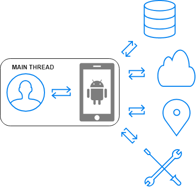

# RxAndroid <!-- omit in toc -->

## Table of Contents <!-- omit in toc -->

- [Why Reactive Programming on Android?](#why-reactive-programming-on-android)
- [What is Reactive Programming?](#what-is-reactive-programming)
- [ReactiveX <a name="reactivex"></a>](#reactivex-a-name%22reactivex%22a)
- [ReactiveX Basics](#reactivex-basics)
    - [Observable and Subscriber](#observable-and-subscriber)
    - [onNext, onCompleted, and onError](#onnext-oncompleted-and-onerror)
    - [“Hot” and “Cold” Observables](#hot-and-cold-observables)
    - [Composition via Observable Operators](#composition-via-observable-operators)
    - [Chaining Operators](#chaining-operators)
- [RxJava and RxAndroid](#rxjava-and-rxandroid)
    - [Observable Types](#observable-types)
    - [Backpressure](#backpressure)
    - [Subject](#subject)
    - [Subject Flavours](#subject-flavours)
    - [Schedulers](#schedulers)
    - [Disposable](#disposable)
    - [TODO: RxLifecycle](#todo-rxlifecycle)
    - [TODO: RxBroadcast](#todo-rxbroadcast)
    - [TODO: RxBinding](#todo-rxbinding)
- [References](#references)

## Why Reactive Programming on Android?

Developing for Android means having to handle with a lot of time intensive processing tasks. While the UI runs on the Main Thread, we have to make networks requests, run persistance operations, access user location, perfom CPU intensive calculations and etc. 



In order to improve user experience, we want to make our application more responsive and we have a few options to do so. One of the most used ways to solve it is with the usage of Callbacks. It works, but as soon as the codebase grows, mantaining a growing number of Callbacks can be though.

Writing asynchronous code is often connected to the following issues:

* **Complicated error processing**. If there are errors in multiple async tasks, these errors have to be taken somewhere. In case the app logic does not allow a task if the previous one was not completed, the problem of standard approach task realization rises up.
* **Callback Hell**. Developing a complex Android app with multiple network connections, user interactions, and animations means the application code might have a bunch of nested callbacks. For example, a callback is received in an async operation, and then another async operation is performed in it with another callback received within, and so on.
* High risk of receiving **untrackable errors**.

**Reactive code can simplify the process of writing async code.**

## What is Reactive Programming?
**Reactive programming is programming with asynchronous data streams.** <br><br>
In a way, this isn't anything new. Event buses or your typical click events are really an asynchronous event stream, on which you can observe and do some side effects. Reactive is that idea on steroids. You are able to create data streams of anything, not just from click and hover events. Streams are cheap and ubiquitous, anything can be a stream: variables, user inputs, properties, caches, data structures, etc. For example, imagine your Twitter feed would be a data stream in the same fashion that click events are. You can listen to that stream and react accordingly. <br><br>
**On top of that, you are given an amazing toolbox of functions to combine, create and filter any of those streams.** That's where the "functional" magic kicks in. A stream can be used as an input to another one. Even multiple streams can be used as inputs to another stream. You can merge two streams. You can filter a stream to get another one that has only those events you are interested in. You can map data values from one stream to another new one.<br><br>
[The introduction to Reactive Programming you've been missing
(by @andrestaltz)](#https://gist.github.com/staltz/868e7e9bc2a7b8c1f754)

## ReactiveX <a name="reactivex"></a>

Reactive Extensions (also known as ReactiveX) is a set of tools allowing imperative programming languages to operate on sequences of data regardless of whether the data is synchronous or asynchronous. It provides a set of sequence operators that operate on each item in the sequence. It is an implementation of reactive programming and provides a blueprint for the tools to be implemented in multiple programming languages.

## ReactiveX Basics 

### Observable and Subscriber

In ReactiveX an Observer subscribes to an Observable. Then that Observer reacts to whatever item or sequence of items the Observable emits. This pattern facilitates concurrent operations because it does not need to block while waiting for the Observable to emit objects, but instead it creates a sentry in the form of an Observer that stands ready to react appropriately at whatever future time the Observable does so.

### onNext, onCompleted, and onError

The Subscribe method is how you connect an observer to an Observable. Your Observer implements some subset of the following methods:

* `onNext` - An Observable calls this method whenever the Observable emits an item. This method takes as a parameter the item emitted by the Observable.
* `onError` - An Observable calls this method to indicate that it has failed to generate the expected data or has encountered some other error. It will not make further calls to onNext or onCompleted. The onError method takes as its parameter an indication of what caused the error.
* `onCompleted` - An Observable calls this method after it has called onNext for the final time, if it has not encountered any errors.

### “Hot” and “Cold” Observables

When does an Observable begin emitting its sequence of items? It depends on the Observable. A “hot” Observable may begin emitting items as soon as it is created, and so any observer who later subscribes to that Observable may start observing the sequence somewhere in the middle. A “cold” Observable, on the other hand, waits until an observer subscribes to it before it begins to emit items, and so such an observer is guaranteed to see the whole sequence from the beginning.

In some implementations of ReactiveX, there is also something called a “Connectable” Observable. Such an Observable does not begin emitting items until its Connect method is called, whether or not any observers have subscribed to it.

### Composition via Observable Operators

Observables and observers are only the start of ReactiveX. By themselves they’d be nothing more than a slight extension of the standard observer pattern, better suited to handling a sequence of events rather than a single callback.

The real power comes with the “reactive extensions” (hence “ReactiveX”) — [operators](http://reactivex.io/documentation/operators.html) that allow you to transform, combine, manipulate, and work with the sequences of items emitted by Observables.

### Chaining Operators

Most operators operate on an Observable and return an Observable. This allows you to apply these operators one after the other, in a chain. Each operator in the chain modifies the Observable that results from the operation of the previous operator.

## RxJava and RxAndroid

RxJava is a Java VM implementation of Reactive Extensions: a library for composing asynchronous and event-based programs by using observable sequences.

RxAndroid adds the minimum classes to RxJava that make writing reactive components in Android applications easy and hassle-free.

### Observable Types

* **Single** is an Observable which only emits one item or throws an error. Method `onNext()` and `onComplete()` of Observable has been combined to onSucess(), as the stream has only one single item to emit.
* **Maybe**  is similar to Single only difference being that it allows for no emissions as well.
* **Completable** is only concerned with execution completion whether the task has reach to completion or some error has occurred. As Completable only concern is completeness it only have `onComplete()` method.

### Backpressure

Suppose you have a source that is emitting data items at a rate of 1 Million items/second. The next step is to make network request on each item. Suppose the device can handle 100 network requests/second. Do you see the problem? The second step is the bottleneck because device can handle at most 100 requests/second and so the huge amount of data from step 1 will cause OOM(Out Of Memory) exception. The below code is a perfect example of that:

```kotlin
val observable = PublishSubject.create<Int>()
  observable.observeOn(Schedulers.computation())
            .subscribeBy (
                onNext ={
                  println("number: ${it}")
                },onError = {t->
                  print(t.message)
                }
            )
    for (i in 0..1000000){
        observable.onNext(i)
    }
```

Observables are used when we have relatively few items over the time and there is no risk of overflooding consumers. If there is a possibility that the consumer can be overflooded, we need *backpressuring* , which in simple words is just a way to handle the items that can’t be processed, then we use **Flowable**.

In the below code, we will handle the case using Flowable:

```kotlin
val observable = PublishSubject.create<Int>()
    observable
            .toFlowable(BackpressureStrategy.MISSING)
            .observeOn(Schedulers.computation())
            .subscribeBy (
                onNext ={
                    println("number: ${it}")
                },onError = {t->
                print(t.message)
            }
            )
    for (i in 0..1000000){
        observable.onNext(i)
    }
```

If you run the above code, you’ll see the output: 

```
Queue is full?!
```

This is because we haven’t specified any BackpressureStrategy, so it falls back to default which basically buffers upto 128 items in the queue. Hence the output Queue is full.

There are a lot of other backpressuring strategy which we will cover now:

* **Dropping:** What do you do when you can’t handle too many things? You drop it. This Backpressuring strategy does the exact same thing. It drops the items if it can’t handle more than it’s capacity i.e. 128 items (size of buffer).
* **Preserve the last item:** If the producer sees that the downstream can’t cope up with the flow of items, it stops emitting it and waits till it becomes available. In the mean time, it keeps dropping the items except the last one that arrived and sends the last one when the downstream is available again.
* **Buffering:** It might not be the best way to handle a lot of emissions, but certainly is a way that is available. In this, you can save the items in a buffer. In this case, items are stored in the buffer till they can be processed.

[RxJava — Flowables — What, when and how to use it? (by @aanandshekharroy)](#https://android.jlelse.eu/rxjava-flowables-what-when-and-how-to-use-it-9f674eb3ecb)

[RxJava2 Docs - BackpressureStrategy](#http://reactivex.io/RxJava/2.x/javadoc/io/reactivex/BackpressureStrategy.html)

### Subject

A **Subject** is a sort of bridge or proxy that acts both as an observer and as an Observable. Because it is an observer, it can subscribe to one or more Observables, and because it is an Observable, it can pass through the items it observes by reemitting them, and it can also emit new items.

A **Relay** is a Subject except without the ability to call onComplete or onError.

### Subject Flavours

* **Publish** starts empty and only emits new elements to subscribers.
* **Replay** keeps a buffer of previous events that will be emitted to new subscriptions.
* **Behaviour** it needs an initial value and replays it or the latest element to new subscribers.

### Schedulers

RxJava operators don't work with Threads or ExecutorServices directly but with so called Schedulers that abstract away sources of concurrency behind a uniform API. RxJava 2 features several standard schedulers accessible via Schedulers utility class.

The `SubscribeOn` operator designates which thread the Observable will begin operating on, no matter at what point in the chain of operators that operator is called. `ObserveOn`, on the other hand, affects the thread that the Observable will use below where that operator appears. For this reason, you may call ObserveOn multiple times at various points during the chain of Observable operators in order to change on which threads certain of those operators operate.

Let’s summarize available Scheduler types and their common uses:

* `Schedulers.io()` is backed by an unbounded thread pool. It is used for non CPU-intensive I/O type work including interaction with the file system, performing network calls, database interactions, etc. This thread pool is intended to be used for asynchronously performing blocking IO.
* `Schedulers.computation()` is backed by a bounded thread pool with size up to the number of available processors. It is used for computational or CPU-intensive work such as resizing images, processing large data sets, etc. Be careful: when you allocate more computation threads than available cores, performance will degrade due to context switching and thread creation overhead as threads vie for processors’ time.
* `Schedulers.newThread()` creates a new thread for each unit of work scheduled. This scheduler is expensive as new thread is spawned every time and no reuse happens.
* `Schedulers.from(Executor executor)` creates and returns a custom scheduler backed by the specified executor. To limit the number of simultaneous threads in the thread pool, use `Scheduler.from(Executors.newFixedThreadPool(n))` . This guarantees that if a task is scheduled when all threads are occupied, it will be queued. The threads in the pool will exist until it is explicitly shutdown.
* `Schedulers.single()` is new in RxJava 2. This scheduler is backed by a single thread executing tasks sequentially in the order requested.
* `Schedulers.trampoline()` executes tasks in a FIFO (First In, First Out) manner by one of the participating worker threads. It’s often used when implementing recursion to avoid growing the call stack.
  
> WARNING: Be careful writing multi-threaded code using unbounded thread Schedulers such as `Schedulers.io()` and `Schedulers.newThread()`. Depending on your data stream and the transformations you apply to it, it’s easier than you think to flood your system with threads.

RxAndroid provides a Scheduler that schedules on the main thread or any given Looper.

`AndroidSchedulers` which provides schedulers ready-made for Android's threading system. Need to run some code on the UI thread? No problem - just use `AndroidSchedulers.mainThread()`. Care should be taken not to overload this thread to prevent janky non-responsive UI or, worse, Application Not Responding” (ANR) dialog.

```java
retrofitService.getImage(url)
    .subscribeOn(Schedulers.io())
    .observeOn(AndroidSchedulers.mainThread())
    .subscribe(bitmap -> myImageView.setImageBitmap(bitmap));
```

If you've got your own Handler, you can create a scheduler linked to it with HandlerThreadScheduler.

### Disposable

Observer is just an interface which has 4 methods. 3 of them we already saw, which are `onNext()`, `onComplete()` and `onError()`. Then there’s also `onSubscribe(Disposable disposable)`.

Disposable is an interface containing two methods.

```java
public interface Disposable {
  void dispose();
  boolean isDisposed();
}
```
`onSubscribe` gets the Disposable as a parameter which can be used for disposing the connection between the Observable and the Observer itself as well as checking whether we’re already disposed or not.

The moment the connection between the Observable and the Observer gets disposed via the Disposable.dispose() method the Observer won’t get any emission from the Observable.

### TODO: RxLifecycle

https://github.com/trello/RxLifecycle

### TODO: RxBroadcast

https://github.com/cantrowitz/RxBroadcast

### TODO: RxBinding

https://github.com/JakeWharton/RxBinding

## References

* http://reactivex.io/
* https://github.com/ReactiveX/RxAndroid/
* https://github.com/ReactiveX/RxJava
* https://gist.github.com/staltz/868e7e9bc2a7b8c1f754
* https://en.wikipedia.org/wiki/Reactive_extensions
* https://blog.danlew.net/2014/09/15/grokking-rxjava-part-1/
* https://www.grokkingandroid.com/rxjavas-side-effect-methods/
* https://proandroiddev.com/understanding-rxjava-subscribeon-and-observeon-744b0c6a41ea
* https://android.jlelse.eu/rxjava-single-maybe-and-completable-8686db42bac8
* https://android.jlelse.eu/making-your-rxjava-intentions-clearer-with-single-and-completable-f064d98d53a8
* https://medium.com/@ValCanBuild/making-rxjava-code-tidier-with-doonsubscribe-and-dofinally-3748f223d32d
* https://medium.com/@vanniktech/rxjava-2-disposable-under-the-hood-f842d2373e64
* https://www.lynda.com/Android-tutorials/RxJava-Design-Patterns-Android-Developers/704139-2.html