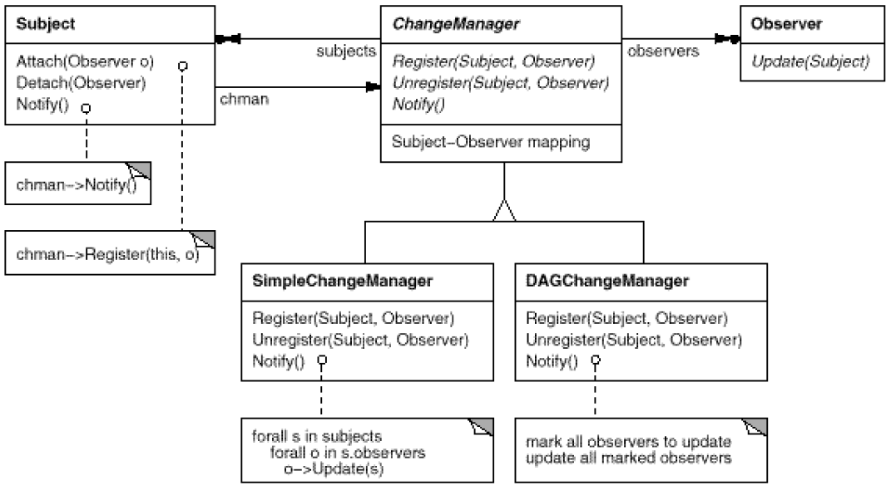
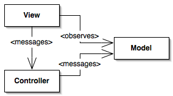

# Observer
<!-- TOC -->

## Table of Contents
- [Intent](#intent)
- [Applicability](#applicability)
- [Implementation](#implementation)
- [Trade-Offs](#trade_offs)
- [Known Uses](#known-uses)
- [References](#references)

<!-- /TOC -->
## Intent <a name="intent"></a>

* Define a one-to-many dependency between objects so that when one object changes state, all its dependents are notified and updated automatically.
* Encapsulate the core (or common or engine) components in a Subject abstraction, and the variable (or optional or user interface) components in an Observer hierarchy.
* The "View" part of Model-View-Controller.

## Applicability <a name="applicability"></a>

Use the Observer pattern in any of the following situations:
* When an abstraction has two aspects, one dependent on the other. Encapsulating these aspects in separate objects lets you vary and reuse them independently.
* When a change to one object requires changing others, and you don't know how many objects need to be changed.
* When an object should be able to notify other objects without making assumptions about who these objects are. In other words, you don't want these objects tightly coupled.

## Implementation <a name="implementation"></a>

The key objects in this pattern are subject and observer. A subject may have any number of dependent observers. All observers are notified whenever the subject undergoes a change in state. In response, each observer will query the subject to synchronize its state with the subject's state.

```java
abstract class Observer {
    abstract void update();
}

abstract class Subject {
    private List<Observer> observers = new ArrayList<>();
    private boolean hasChanged;

    public void addOserver(Observer o) {
        observers.add(o);
    }

    public void deleteObserver(Observer o) {
        observers.remove(o);
    }

    public void deleteObservers() {
        observer.clear();
    }

    protected void setChanged() {
        hasChanged = true;
    }

    protected void clearChanged(){
        hasChanged = false;
    }

    protected void notifyObservers() {
        if(hasChanged) {
            for (Observer observer : observers) {
                observer.update();
            }
        }
    }
}
```

```java
class ConcreteSubject extends Subject {
    public int state = 0;

    public void changeState() {
        state++;

        setChanged();
        notifyObservers();
    }

    public int getState(){
        return state;
    }
}

class ConcreteObserver extends Observer {
    private ConcreteSubject subject;

    public ConcreteObserver(ConcreteSubject subject) {
        this.subject = subject;
        this.subject.addObserver(this);
    }

    @Override
    public void update() {
        System.out.print("OnSubjectUpdate - "+ Integer.toString(subject.getState()));
    }
}

class Main {
    public static void main(String[] args) {
        ConcreteSubject subject = new ConcreteSubject();

        ConcreteObserver observer_1 = new ConcreteObserver(subject);
        ConcreteObserver observer_2 = new ConcreteObserver(subject);
        ConcreteObserver observer_3 = new ConcreteObserver(subject);

        subject.changeState();
    }
}

```

## Trade-Offs <a name="trade-offs"></a> 

1. *Mapping subjects to their observers.* The simplest way for a subject to keep track of the observers it should notify is to store references to them explicitly in the subject. However, such storage may be too expensive when there are many subjects and few observers. One solution is to trade space for time by using an associative look-up (e.g., a hash table) to maintain the subject-to-observer mapping. Thus a subject with no observers does not incur storage overhead. On the other hand, this approach increases the cost of accessing the observers.

2. *Observing more than one subject.* It might make sense in some situations for an observer to depend on more than one subject. For example, a spreadsheet may depend on more than one data source. It's necessary to extend the Update interface in such cases to let the observer know which subject is sending the notification. The subject can simply pass itself as a parameter in the Update operation, thereby letting the observer know which subject to examine.

3. *Who triggers the update?* The subject and its observers rely on the notification mechanism to stay consistent. But what object actually calls Notify to trigger the update? Here are two options:
    1. Have state-setting operations on Subject call Notify after they change the subject's state. The advantage of this approach is that clients don't have to remember to call Notify on the subject. The disadvantage is that several consecutive operations will cause several consecutive updates, which may be inefficient.

    2. Make clients responsible for calling Notify at the right time. The advantage here is that the client can wait to trigger the update until after a series of state changes has been made, thereby avoiding needless intermediate updates. The disadvantage is that clients have an added responsibility to trigger the update. That makes errors more likely, since clients might forget to call Notify.

4. *Dangling references to deleted subjects.* Deleting a subject should not produce dangling references in its observers. One way to avoid dangling references is to make the subject notify its observers as it is deleted so that they can reset their reference to it. In general, simply deleting the observers is not an option, because other objects may reference them, or they may be observing other subjects as well.

5. *Making sure Subject state is self-consistent before notification.* It's important to make sure Subject state is self-consistent before calling Notify, because observers query the subject for its current state in the course of updating their own state.
This self-consistency rule is easy to violate unintentionally when Subject subclass operations call inherited operations. For example, the notification in the following code sequence is trigged when the subject is in an inconsistent state:
    ```
        void MySubject::Operation (int newValue) {
            BaseClassSubject::Operation(newValue);
            // trigger notification
            _myInstVar += newValue;
            // update subclass state (too late!)
        }
    ```
    You can avoid this pitfall by sending notifications from template methods in abstract Subject classes. Define a primitive operation for subclasses to override, and make Notify the last operation in the template method, which will ensure that the object is self-consistent when subclasses override Subject operations.
    ```
        void Text::Cut (TextRange r) {
            ReplaceRange(r); // redefined in subclasses
            Notify();
        }
    ```
    By the way, it's always a good idea to document which Subject operations trigger notifications.

6. *Avoiding observer-specific update protocols:* the push and pull models. Implementations of the Observer pattern often have the subject broadcast additional information about the change. The subject passes this information as an argument to Update. The amount of information may vary widely.<br>
At one extreme, which we call the push model, the subject sends observers detailed information about the change, whether they want it or not. At the other extreme is the pull model; the subject sends nothing but the most minimal notification, and observers ask for details explicitly thereafter.<br>
The pull model emphasizes the subject's ignorance of its observers, whereas the push model assumes subjects know something about their observers' needs. The push model might make observers less reusable, because Subject classes make assumptions about Observer classes that might not always be true. On the other hand, the pull model may be inefficient, because Observer classes must ascertain what changed without help from the Subject.

7. *Specifying modifications of interest explicitly.* You can improve update efficiency by extending the subject's registration interface to allow registering observers only for specific events of interest. When such an event occurs, the subject informs only those observers that have registered interest in that event. One way to support this uses the notion of aspects for Subject objects. To register interest in particular events, observers are attached to their subjects using `
void Subject::Attach(Observer*, Aspect& interest)`
where interest specifies the event of interest. At notification time, the subject supplies the changed aspect to its observers as a parameter to the Update operation. For example: 
`void Observer::Update(Subject*, Aspect& interest);`

8. *Encapsulating complex update semantics.* When the dependency relationship between subjects and observers is particularly complex, an object that maintains these relationships might be required. We call such an object a ChangeManager. Its purpose is to minimize the work required to make observers reflect a change in their subject. For example, if an operation involves changes to several interdependent subjects, you might have to ensure that their observers are notified only after all the subjects have been modified to avoid notifying observers more than once.
ChangeManager has three responsibilities:
    1. It maps a subject to its observers and provides an interface to maintain this mapping. This eliminates the need for subjects to maintain references to their observers and vice versa.
    2. It defines a particular update strategy.
    3. It updates all dependent observers at the request of a subject.
    The following diagram depicts a simple ChangeManager-based implementation of the Observer pattern. There are two specialized ChangeManagers. SimpleChangeManager is naive in that it always updates all observers of each subject. In contrast, DAGChangeManager handles directed-acyclic graphs of dependencies between subjects and their observers. A DAGChangeManager is preferable to a SimpleChangeManager when an observer observes more than one subject. In that case, a change in two or more subjects might cause redundant updates. The DAGChangeManager ensures the observer receives just one update. SimpleChangeManager is fine when multiple updates aren't an issue.

        
        
        ChangeManager is an instance of the Mediator pattern. In general there is only one ChangeManager, and it is known globally. The Singleton pattern would be useful here.
9. Combining the Subject and Observer classes. Class libraries written in languages that lack multiple inheritance (like Smalltalk) generally don't define separate Subject and Observer classes but combine their interfaces in one class. That lets you define an object that acts as both a subject and an observer without multiple inheritance. In Smalltalk, for example, the Subject and Observer interfaces are defined in the root class Object, making them available to all classes.

## Known Uses <a name="known_uses"></a>

The first and perhaps best-known example of the Observer pattern appears in Model/View/Controller (MVC). MVC's Model class plays the role of Subject, while View is the base class for observers.



## References <a name="references"></a>

* Design Patterns, Elements of Reusable Object-Oriented Software, GoF
* https://sourcemaking.com/design_patterns/observer


# Olavo otario 